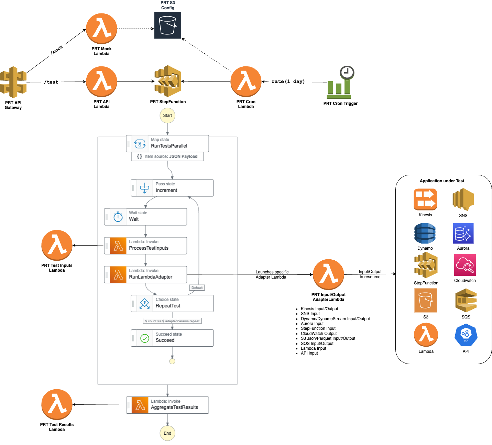
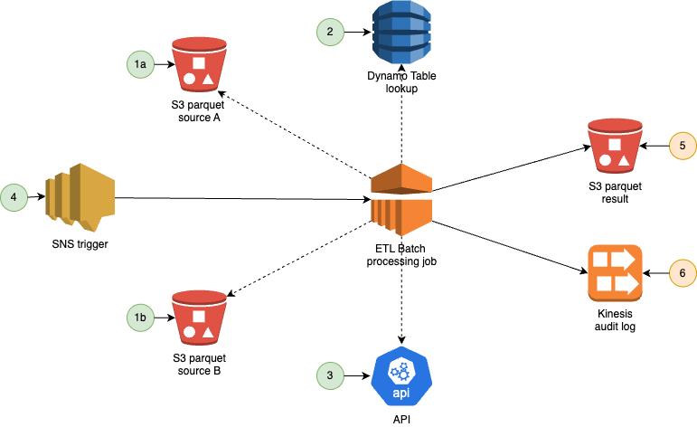
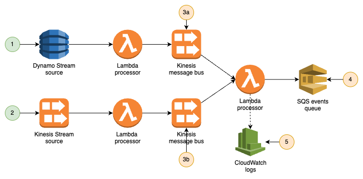

# ProRey Testing


by [ProRey Tech](https://prorey.com)



 **PRT** ProRey Testing is Serverless Application orchestrating parallel Component Tests in AWS account

### PRT Overview

#### Main features

  * PRT interacts with AWS components via tests configured in json format 
  * Tests are executed independently of each other at specific time and could be repeated
  * Tests are either input or output type, input tests write data to resources, output tests read data from resources and validate it using json intersect
  * Tests are organized in test stories, test story fails if any of its tests fail
  * Test json files could include dynamic calculations with python inline eval

#### Additional information

  * PRT could be used for data conditioning to write dynamic synthetic data adhoc or with cron schedule
  * PRT could be used for bulk data generation or perf testing with repeated data inputs
  * PRT is easy to adopt and integrate, tests could be launched through AWS console, AWS cli, API call or cron schedule
  * PRT infra is easy to deploy using generic AWS CloudFormation templates
  * PRT could also be used for API Mocking with dynamic responses and retries

#### Benefits

  * No servers maintenance needed, serverless AWS Step Function and Lambdas are used 
  * Low infra costs, you pay only when Step Function and Lambdas are invoked
  * Easy to extend, add Input and Output Adapter Lambdas as lightweight inline editable python utilizing boto3
  * Easy to monitor, use rich Step Function Execution UI or Step Function and detailed Lambdas CloudWatch logs

### Examples of PRT Component Tests of Composite Applications

#### Component Testing of ETL batch processing job
  ##### Composite Application
  Client has long running ETL Batch processing job aggregating data from multiple S3 parquet source files and enhancing it with Dynamo Table look ups and API calls.
  Data is then written to S3 parquet result files and streamed into Kinesis audit log. Batch processing is triggered with SNS event.

  ##### PRT Component Tests
  1. json data to generate parquet files in S3 locations and time when to write data
  2. json dynamo items to be written to Dynamo Table and time when to write data
  3. json mocks for API calls
  4. json for synthetic SNS event to trigger ETL job and time when to send it
  5. json data to validate S3 parquet files outputs and time when to do it
  6. json data to validate messages in Kinesis audit log and time when to do it
  
  

#### Performance Testing of ETL batch processing job

  ##### Composite Application
  Same as above with bulk synthetic parquet data generated

  ##### PRT Component Tests
  Includes json data with dynamically generated key fields and test inputs repeated

#### Component Testing of realtime streaming application

  ##### Composite Application
  Client has realtime streaming application listening to source dynamo and kinesis steams, aggregating and transforming data via intermediate kinesis message bus and writing data out to SQS queues and logging with CloudWatch logs

  ##### PRT Component Tests
  1. json dynamo items to be written to Dynamo Table and time when to write data
  2. json kinesis messages to be written to Kinesis source and time when to write data
  3. json data to validate in Kinesis message bus and time when to do it
  4. json events to validate in SQS events queue and time when to do it
  5. json data to validate in CloudWatch logs and time when to do it

  


#### Performance Testing of realtime streaming application

  ##### Composite Application
  Same as above with bulk data streaming

  ##### PRT Component Tests
  Includes json data with dynamically generated key fields and test inputs repeated

#### Examples of PRT test files
  for all input and output jsons could be found in `/examples` folder

### PRT Infra Deployment

* Create PRT S3 Bucket and deploy PRT code, see [Deploy PRT Lambdas package](#deploy-prt-lambdas-package) and [Deploy PRT Layers](#deploy-prt-layers) sections
* Deploy PRT Step Function and Lambdas with CloudFormation template, provide `StackIdentifier` and `PrtBucket` parameters
* Deploy PRT API Gateway with CloudFormation template `prt-api.yaml`, provide `StackIdentifier` parameter (or deploy PRT ALB with CloudFormation template `prt-alb.yaml`)
* Add IAM policies to `prt-lambda-role-<StackIdentifier>` role to grant resources access to PRT Adapter Lambdas, see eg `prt-adapters-policy.json`
    * API Gateway integration timeout `TimeoutInMillis` in `prt-infra.yaml` could be increased from default max `29000`ms to `180000`ms by AWS service limit increase request
    * For PRT Cron Trigger tests execution, configure `prt-cron-trigger-<StackIdentifier>` EventBridge rule and upload `prt_test.json` to PRT S3 Bucket, see [Run PRT tests with AWS Cron Trigger](#run-prt-tests-with-aws-cron-trigger) section
    * For PRT Mock virtualization, upload mocks to PRT S3 Bucket, see [Configure PRT Mocks](#configure-prt-mocks) section

### Running PRT Tests

#### Spec for PRT test json

```json
{
    "test_run_name": "<Name of Test Run>",
    "test_run_description": "<Description of Test Run>",
    "tests": [
      {
        "id": "<ID of individual test>",
        "description": "<Description of individual test>",
        "wait_sec": "<Number of seconds to wait before individual test>",
        "repeat": "<Number of repeat sequential runs of individual test (optional)>",
        "story_id": "<ID of a test story which is collection of individual tests>",
        "story_name": "<Name of a test story, could be specified once per story_id>",
        "lambda_adapter": "<Name of lambda adapter to run individual test, eg prt-s3-input-lambda>",
        "lambda_config": "<Json configuration for lambda_adapter>",
        "input": "<Json input for lambda_adapter, depending on type, needs either input or output field, see below>",
        "output": "<Json intersect output for lambda_adapter>",
        "expected": "<Set to false to validate output json intersect absence (optional)>"
      }
    ]
  }
```

#### PRT API Lambda Interface

* PRT API call example (through Gateway) to start PRT execution with **`POST`** `/test` endpoint
  ```shell
  curl -kLX POST 'https://'${API_ID}'.execute-api.us-east-1.amazonaws.com/prt/test' \
  --data '{
    "test_run_name": "PRT smoke test",
    "test_run_description": "Testing that PRT is operational with S3 and SQS",
    "tests": [
      {
        "id": "001",
        "description": "Copy S3 file 3 times with 1 second delay",
        "wait_sec": 1,
        "repeat": 3,
        "story_id": "1",
        "story_name": "PRT S3 Test",
        "lambda_adapter": "prt-s3-input-lambda",
        "lambda_config": {
          "s3_bucket": "prorey.testing"
        },
        "input": {
          "source_key": "test/test_source_s3.json",
          "destination_key.$": "'test/test-destination/test_dest_' + str(uuid.uuid4()) + '.json'"
        }
      },
      {
        "id": "002",
        "description": "Write to SQS",
        "wait_sec": 0,
        "story_id": "2",
        "story_name": "PRT SQS Test",
        "lambda_adapter": "prt-sqs-input-lambda",
        "lambda_config": {
          "queue_url": "https://sqs.us-east-1.amazonaws.com/{{AWS_ID}}/prt-sqs-test"
        },
        "input": {
          "name": "Bob",
          "age": 27
        }
      },
      {
        "id": "003",
        "description": "Read from SQS",
        "wait_sec": 2,
        "story_id": "2",
        "story_name": "PRT SQS Test",
        "lambda_adapter": "prt-sqs-output-lambda",
        "lambda_config": {
          "queue_url": "https://sqs.us-east-1.amazonaws.com/{{AWS_ID}}/prt-sqs-test"
        },
        "output": {
          "Messages": [
            {
              "name": "Bob",
              "age": 27
            }
          ]
        }
      }
    ]
  }'
  ```
    * use **`POST`** `test/execute` (returns `<EXECUTION_NAME>`) and **`GET`** `test/describe/<EXECUTION_NAME>` to execute tests asynchronously for test runs lasting longer than 3 minutes.

* PRT API response body example with individual `tests` organized to `stories`
  ```json
  {
    "test_run_name": "PRT smoke test",
    "test_run_description": "Testing that PRT is operational with S3 and SQS",
    "total_stories": 2,
    "passed_stories": 2,
    "failed_stories": 0,
    "stories": [
      {
        "story_id": "1",
        "story_name": "PRT S3 Test",
        "story_status": "PASSED",
        "tests": [
          {
            "id": "001",
            "description": "Copy S3 file 3 times with 1 second delay",
            "status": "PASSED"
          }
        ]
      },
      {
        "story_id": "2",
        "story_name": "PRT SQS Test",
        "story_status": "PASSED",
        "tests": [
          {
            "id": "002",
            "description": "Write to SQS",
            "status": "PASSED"
          },
          {
            "id": "003",
            "description": "Read from SQS",
            "status": "PASSED"
          }
        ]
      }
    ]
  }
  ```

#### Run PRT tests with AWS CLI

* Run tests in PRT Step Function with test input file
  ```shell
  aws stepfunctions start-execution \
  --state-machine-arn arn:aws:states:<region>:<account>:stateMachine:prt-step-function-<StackIdentifier> \
  --input file://examples/prt_test.json \
  --region <region> \
  --profile <profile>
  ```

#### Run PRT tests with AWS Admin Console

* Open Step Functions service in AWS console
* Find PRT step function in State Machines list
* Click `Start Execution` button and copy test input json into `Input` text box
* Monitor parallel tests running in `Graph View`, click `Run Test Router` to see individual test inputs and outputs
* Check test results in `Execution Input and Output` tab

#### Run PRT tests with AWS Cron Trigger

Configure following parameters to eg run every day
```yaml
CronTriggerExpression: run(1 day)
CronTriggerState: ENABLED
CronTestInputPrefix: cron
```

PRT will run according to `CronTriggerExpression` expression, pulling test input file from S3 location
```
s3://<PrtBucket>/<CronTestInputPrefix>/prt-cron-trigger-<StackIdentifier>/prt_test.json
```

### PRT Adapter Lambdas

These are PRT Adapter Lambdas that can be used to provide inputs or check outputs during PRT tests execution.


* **prt-cloudwatch-output-lambda**

    Validates CloudWatch logs, see AWS filterPattern docs:

    [FilterPattern](https://docs.aws.amazon.com/AmazonCloudWatchLogs/latest/APIReference/API_FilterLogEvents.html#CWL-FilterLogEvents-request-filterPattern)

    [Regex syntax](https://docs.aws.amazon.com/AmazonCloudWatch/latest/logs/FilterAndPatternSyntax.html#regex-expressions)

    * lambda config
      ```json
      "lambda_config": {
        "listen_sec": "<Number of seconds to search for logs>",
        "log_group": "<Key Name>"
      }
      ```
    * example output
      ```json
      "output": {
          "pattern": "START",
          "minimum_occurrences": 1
      }
      ```

* **prt-dynamo-input-lambda**

    Puts/deletes items in Dynamo Table

    * lambda config
      ```json
      "lambda_config": {
        "dynamo_table": "<Dynamo Table Name>",
        "key_attribute": "<Key Name>",
        "key_type": "<Key Type>"
      }
      ```
    * example input
      ```json
      "input": {
        "Items": [
          {
            "user_id": {
              "S": "001"
            },
            "name": {
              "S": "Bob"
            },
            "age": {
              "N": "27"
            }
          }
        ]
      }
      ```
  
* **prt-dynamo-output-lambda**

    Validates items in Dynamo Table

    * lambda config
      ```json
      "lambda_config": {
        "dynamo_table": "<Dynamo Table Name>"
      }
      ```
    * example output
      ```json
      "output": {
        "Items": [
          {
            "user_id": {
              "S": "001"
            },
            "name": {
              "S": "Bob"
            },
            "age": {
              "N": "27"
            }
          }
        ]
      }
      ```

* **prt-dynamostream-output-lambda**
  
    Validates item operations in Dynamo Stream

    * lambda config
      ```json
      "lambda_config": {
        "dynamo_table": "<Dynamo Table Name>",
        "operation": "INSERT, MODIFY or REMOVE"
      }
      ```
    * example output
      ```json
      "output": {
        "user_id": {
          "S": "001"
        },
        "name": {
          "S": "Bob"
        },
        "age": {
          "N": "27"
        }
      }
      ```
  
* **prt-iam-output-lambda**

    Validates that IAM Role exists

    * lambda config
      ```json
      "lambda_config": {
        "role_name": "<IAM Role Name>"
      }
      ```

* **prt-api-output-lambda**

    Validates that API is healthy

    * lambda config
      ```json
      "lambda_config": {
        "health_url": "<API Health Endpoint>"
      }
      ```

* **prt-aurora-input-lambda**

    Runs sql on AuroraDB

    Requires `prt-aurora-layer`
 
    * lambda config
      ```json
      "lambda_config": {
        "endpoint": "<AWS Host>",
        "port": "<Port>",
        "region": "<AWS Region>",
        "db_name": "<DB Name>",
        "user": "<User Key>",
        "secret":"<Secret Key>"
      }
      ```  
    * example input
      ```json
      "input": {
        "sql_query": "INSERT INTO aurora_table(name, age) VALUES ('Bob', 27)"
      }
      ```
    
* **prt-kinesis-input-lambda**

    Puts records to Kinesis Stream

    * lambda config
      ```json
      "lambda_config": {
        "kinesis_stream": "<Kinesis Stream Name>"
      }
      ```
    * example input
      ```json
      "input": {
        "name": "Bob",
        "age": 27
      }
      ```

* **prt-kinesis-output-lambda**

    Validates records in Kinesis Stream
    
    * lambda config
      ```json
      "lambda_config": {
        "kinesis_stream": "<Kinesis Stream Name>"
      }
      ```
    * example output
      ```json
      "output": {
        "name": "Bob",
        "age": 27
      }
      ```

* **prt-sqs-input-lambda**

    Puts records to SQS Queue

    * lambda config
      ```json
      "lambda_config": {
        "queue_url": "<SQS Queue URL>"
      }
      ```
    * example input
      ```json
      "input": {
        "name": "Bob",
        "age": 27
      }
      ```

* **prt-sqs-output-lambda**

    Validates records in SQS Queue

    * lambda config
      ```json
      "lambda_config": {
        "queue_url": "<SQS Queue URL>"
      }
      ```
    * example output
      ```json
      "output": {
        "Messages": [
          {
            "name": "Bob",
            "age": 27
          }
        ]
      }
      ```
    
* **prt-s3-input-lambda**

    Copies S3 files from source folder to destination input folder
    
    * lambda config
      ```json
      "lambda_config": {
        "s3_bucket": "<S3 Bucket Name>"
      }
      ```
    * example input
      ```json
      "input": {
        "source_key": "test/test_source_s3.json",
        "destination_key": "test/test_dest_s3.json"
      }
      ```

* **prt-s3-output-lambda**

    Validates json intersect output of parquet and json output files

    Requires `prt-pandas-layer`

    * lambda config
      ```json
      "lambda_config": {
          "s3_bucket": "<S3 Bucket Name>",
          "s3_key": "<S3 Key>",
          "s3_prefix": "<Use S3 prefix if s3_key is not provided>",
          "file_type": "<json or parquet>",
          "file_max_age": "<File maximum age in seconds>"
      }
      ```
    * example output
      ```json
      "output": {
        "1": {
          "name": "Bob",
          "age": 27
        }
      }
      ```
  
* **prt-parquet-input-lambda**

    Generates parquet file in S3 bucket based on `index` json input and inferred types

    Requires `prt-pandas-layer`

    * lambda config
      ```json
      "lambda_config": {
        "s3_bucket": "<S3 Bucket Name>",
        "s3_key": "<S3 Key>"
      }
      ```
    * example input
      ```json
      "input": {
        "1": {
          "name": "Bob",
          "age": 27
        }
      }
      ```

* **prt-sns-input-lambda**

    Publishes events to SNS topic
  
    * lambda config
      ```json
      "lambda_config": {
        "sns_topic": "<SNS Topic ARN>"
      }
      ```
    * example input
      ```json
      "input": {
        "Subject": "Notice",
        "Message": "Hello"
      }
      ```

* **prt-stepfunction-input-lambda**

    Invokes Step Function
  
    * lambda config
      ```json
      "lambda_config": {
        "stepfunction_arn": "<Step Function ARN>"
      }
      ```
    * example input
      ```json
      "input": {
        "field1": "value1"
      }
      ```

* **prt-lambda-input-lambda**

    Invokes Lambda and validates response
  
    * lambda config
      ```json
      "lambda_config": {
        "lambda_arn": "<Lambda ARN>",
        "invocation_type": "<sync or async>"
      }
      ```
    * example input
      ```json
      "input": {
        "payload": {
          "action": "count_nodes"
        },
        "response_status_code": 200,
        "response_payload": {
          "nodes": 2066
        }
      }
      ```

### Dynamic calculations with python inline eval

  * Use `.$` suffix to indicate `eval` field and `$.` prefix for jsonpath field substitution, for example following json
    ```json
    "path": "test",
    "input": {
        "source_key.$": "'$.path/' + datetime.datetime.now().strftime('%d%m%Y') + '/test_source_s3.json'",
        "destination_key.$": "'$.path/test-destination/test_dest_' + str(uuid.uuid4()) + '.json'"
      }
    ```
    will be evaluated to the following test `input` json, calculating today's date and random uuid
    ```json
    "input": {
        "source_key": "test/16092024/test_source_s3.json'",
        "destination_key": "test/test-destination/test_dest_0adb9772-7d60-45a8-8003-3946eefffc4b.json"
      }
    ```

  * Use `$$.Region`, `$$.Account`, `$$.ExecutionName`, `$$.StartTime` syntax to inject variables from step function context, eg
    ```json
    "lambda_config": {
        "lambda_arn.$": "arn:aws:lambda:$$.Region:$$.Account:function:CountNodesLambda",
        "invocation_type": "sync"
      }
    ```
    will be evaluated using step function region and account as
    ```json
    "lambda_config": {
        "lambda_arn": "arn:aws:lambda:us-east-1:123412341234:function:CountNodesLambda",
        "invocation_type": "sync"
      }
    ```


### Deploy PRT Lambdas package

PRT Lambdas are packaged in zip library used by CloudFormation to deploy infra

* Download package from `/code/prt-lambdas.zip`
    * You could also build package from source with
      ```
      zip code/prt-lambdas.zip *.py
      ```
* Upload `prt-lambdas.zip` file to PRT S3 `/code` folder

### Deploy PRT Layers

#### Deploy PRT Util Layer

* Download layer from `/code/prt-util-layer.zip`
    * You could also build layer from sources with
      ```shell
      python3.11 -m pip install -r layers/prt-util-layer.txt -t util-layer/python/lib/python3.11/site-packages/
      cd util-layer
      zip -r ../code/prt-util-layer.zip python
      ```
* Upload `prt-util-layer.zip` file to PRT S3 `/code` folder

#### Deploy PRT Aurora Layer

* Download layer from `/code/prt-aurora-layer.zip`
    * You could also build layer from sources with
      ```shell
      python3.11 -m pip install -r layers/prt-aurora-layer.txt -t aurora-layer/python/lib/python3.11/site-packages/
      cd aurora-layer
      zip -r ../code/prt-aurora-layer.zip python
      ```
* Upload `prt-aurora-layer.zip` file to PRT S3 `/code` folder

#### Deploy AWS Pandas Layer

* Download AWS provided pandas layer, eg [AWSSDKPandas-Python311](https://serverlessrepo.aws.amazon.com/applications/us-east-1/336392948345/aws-sdk-pandas-layer-py3-11)
* Upload `AWSSDKPandas-Python311.zip` file to PRT S3 `/code` folder

# PRT Mock

**PRT Mock** is serverless application where Lambda API used for mocking API calls.
PRT Mock could be used to ease tests isolation.

### Spec for Lambda Mock File

```json
{
  "mocks": [
    {
      "mockId": "<mock identifier>",
      "description": "<mock description>",
      "testCaseId": "<corresponding test identifier (optional)>",
      "timeout": "<mock timeout in milliseconds>",
      "eval": "<set to true to python eval() *.$ response body fields (optional)>",
      "request": {
        "httpMethod": "<GET, POST, PUT or PATCH>",
        "headers": "<json intersect to match>",
        "path": "<path to be matched exactly>",
        "pathRegex": "<path regex to match>",
        "queryStringParameters": "<json intersect to match>",
        "body": "<json intersect to match>",
        "bodyRegex": "<soap xml regex to match>"
      },
      "response": {
        "statusCode": "<response code, eg 200, 404, 500>",
        "body": "<response body json or base-64 encoded soap xml>",
        "headers": "<json or base-64 encoded soap xml (optional)>",
        "retryCount": "number of retries before returning retry response described below (optional)",
        "retryStatusCode": "<retry response code, eg 200, 404, 500 (optional)",
        "retryBody": "<retry response body json or base-64 encoded soap xml (optional)>"
      }
    }
  ]
}
```  
* PRT Mock API call with **`GET`** `/mock` endpoint, API Gateway example
  ```shell
  curl -kLX GET 'https://'${API_ID}'.execute-api.us-east-1.amazonaws.com/prt/mock/oauth2/token'
  ```

* PRT Mock file example (PRT Mock API pulls it from PRT S3)
```json
{
  "mocks": [
    {
      "mockId": "1",
      "description": "OAuth mock",
      "testCaseId": "001",
      "timeout": 100,
      "request": {
        "httpMethod": "GET",
          "path": "/oauth2/token"
      },
      "response": {
        "statusCode": 200,
        "body": {
          "token": "fake token"
        },
        "retryCount": 3,
        "retryStatusCode": 503,
        "retryBody": {
            "description": "Token Service Unavailable"
        }
      }
    }
  ]
}
```

### Configure PRT Mocks

* Upload S3 lambda mocks to `PrtBucket` and PRT Mock will use `LambdaMockPrefix` to retrieve them recursively.

* Use PRT API Gateway url to check that lambda mock is healthy
  ```shell
  curl -kLX GET 'https://'${API_ID}'.execute-api.us-east-1.amazonaws.com/prt/mock/health'
  ```
  to receive `mock is healthy` response and to **reset** mocks cache from PRT S3 (needs to be done after updating mock files)

## APIs Mocking  

### Request Matching  

Refer to `lambda_mock.py` for details, code is straightforward and inline editable.  
Code is using `get_json_intersection(expected, actual)` util for json matching   

* **path** is matched exactly (`equalTo`)  
  eg `/users/123456`  

* **httpMethod** is matched exactly (`equalTo`)  
  eg `GET`  

* **queryStringParameters** are matched via json intersect  
  eg to match `?userId=123456`  
  use `"queryStringParameters":{"userId":"123456"}`  

* **headers** are matched via json intersect  
  eg use `"headers":{"userId":"123456"}`   
  
* **json body** is matched via json intersect  
  eg use `"body":{"user":{"name":"John"}}`  

* **xml body** is matched via regex (`re.search()`)  
  eg for SOAP request to match xml `<soapenv:Envelope> ... <v1:UserId>123456</v1:UserId> ... </soapenv:Envelope>`  
  use `"bodyRegex": "123456"`  

### Response

#### Response Body

* **json body**   
  use full json, eg
  ```json
  "body": {  
    "user": "Bob",
    "age": 27
  }
  ```  

* **xml body**   
  use base64 encoded xml string, eg for SOAP response
  `"body": "PFM6RW52ZWxvcGUgeG1sbnM6Uz0iaHR0cDov..."`

#### Static Response 

Once a request is made, PRT Mock will try to find a matching mock and will return response body found in the mock. 

#### Dynamic Response with eval

  PRT Mock uses `eval` flag for response to be dynamically evaluated with python `eval()` function. It uses `.$` suffix to indicate eval field and `$.` prefix for request jsonpath field substitution.

  Request example with dynamic response
  ```shell
  curl -kLX POST 'https://'${API_ID}'.execute-api.us-east-1.amazonaws.com/prt/mock/account/10000' \
  --data '{
    "date": "Jun 15, 2023",
    "current": {
      "amount": "9.99"
    }
  }'
  ```

  Mock Response body example with dynamically evaluated dates and numbers with the use of python `eval()`
  ```json
  {
    "name": "Bob",
    "today.$": "datetime.datetime.now().strftime('%d/%m/%Y')",
    "tomorrow.$": "(datetime.datetime.now() + datetime.timedelta(days=1)).strftime('%d/%m/%Y')",
    "upcoming": {
      "status": "PENDING",
      "calculated_date.$": "(datetime.datetime.strptime('$.date', '%b %d, %Y') + datetime.timedelta(days=30)).strftime('%d/%m/%Y')",
      "calculated_amount.$": "str(round(float('$.current.amount') * 1.1, 2))"
    }
  }
  ```

  Dynamically calculated Response example
  ```json
  {
    "name": "Bob",
    "today": "28/06/2023",
    "tomorrow": "29/06/2023",
    "upcoming": {
      "status": "PENDING",
      "calculated_date": "15/07/2023",
      "calculated_amount": "10.99"
    }
  }
  ```

#### Mock Retries

Configure `retryCount` to number of times PRT mock will return `retryStatusCode` with `retryBody`before returning regular `response`. After that cycle repeats. This feature could be used to test orchestrator APIs error handling.

#### Mock Timeout  

Use `timeout`(ms) field in mock file to configure API response timeout
